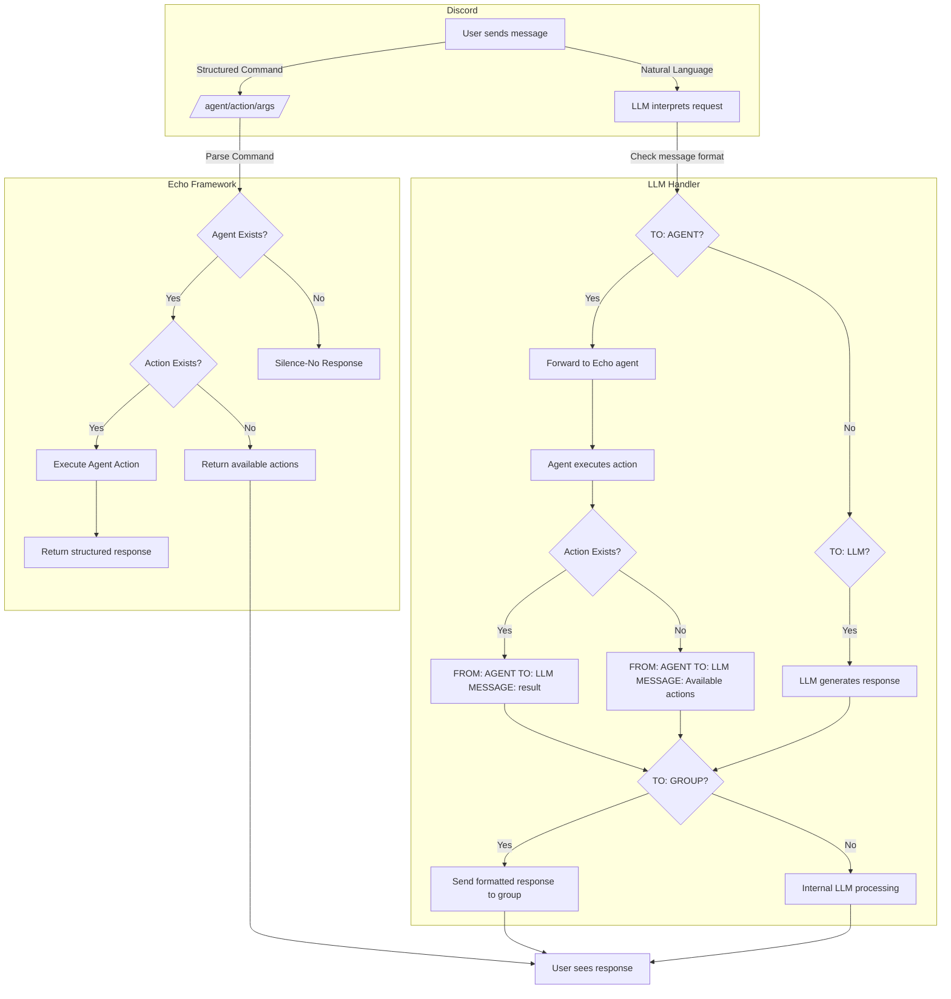

# Echo 

Echo is a python chat-bot agent framework, inspired in syntax by Flask, that maps Discord chat messages following the ``/{Agent}/{Action}/{arguments}`` syntax onto your code in the same way Flask maps HTTP events onto your code. This framework is used to expose specific actions in a chat conversation, using a syntax that supports usage by intelligent agents that might be involved in a conversation.

Echo chat-bot's have to be "invited" to participate in a conversation. They always answer and participate in direct messages with users, they can be ``@mentioned join`` to join any channel, and ``@mention leave`` to exit the conversation. 

Echo exposes a /echo agent with the following actions
```
/echo/list/{}
/echo/add_channel/{channel}
/echo/remove_channel/{channel}
```

Echo uses a bot channels interface with get_channels, add_channel, remove_channel functions to allow external persistence of the channels the bot is participating in. Stage0_utils provides this as BotServices or via the bot_agent. 

Echo uses a conversation interface with add_message function to allow external persistence of bot-conversations. Stage0_utils provides this as ConversationServices or via the conversation_agent.

# Echo - A Chat Bot Agent Framework

Echo is a Python-based chatbot framework inspired by Flask. Echo implements **multi-party conversational AI** that can interact within a group setting while maintaining structured agent interactions. 

Features
 - Agent-based command routing using /agent/action/arguments syntax.
 - Discord integration with structured conversation filtering.
 - Natural Language intent and execution of actions
 - Modular design allowing easy addition of new agents.

## Project Structure
```
echo
┣ echo.py            # Core Echo agent framework
┣ discord_bot.py     # Discord client, listens for messages
┣ llm_handler.py     # LLM-driven message interpretation
┣ agents/
┃ ┣ echo_agent.py    # Default built-in Echo agent
┃ ┣ bot_agent.py     # Example: Handles bot-related commands
┗ README.md          # Documentation
```

# LLM Chat 
The /agent/action/parameters syntax is very precise, but extremely terse. For that reason, we have an LLM chat interface that is capable of understanding intent, and formatting the agent action appropriately. The LLM implements a Retrieval Augmented Generation approach that formats an agent request to collect additional information, and interprets the response to back to the group.

# Message Flow Diagram

--- 

### Example Conversation
```
FROM: @Alice
TO: GROUP
MESSAGE: Hey, what's the status of our channels?
```
---
```
FROM: FRAN_LLM
TO: AGENTS
MESSAGE: /echo/list/
```
---
```
FROM: FRAN_AGENT
TO: FRAN_LLM
MESSAGE: Active channels: #general, #bot-commands
```
---
```
FROM: FRAN_LLM
TO: GROUP
MESSAGE: We are currently active in #general and ```
---
```
