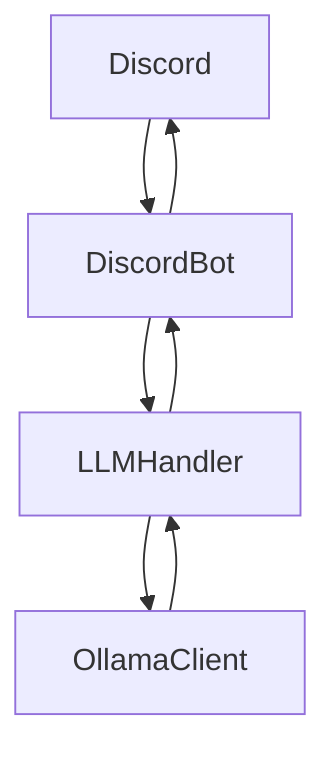

# Echo - A Multi-Party Conversational AI Framework

Echo is a Python-based Discord chatbot agent framework inspired by Flask. Since Agent/Action syntax can be terse, Echo uses a **multi-party conversational AI** to act as a bridge between human group conversations (outer dialog) and structured agent interactions (inner dialog).

## **How Echo Works**
- Echo operates in **two conversational layers:**
  - **External Dialog:** The LLM interacts naturally with users in a group chat.
  - **Inner Dialog:** The LLM privately communicates with structured agents.
- The LLM follows a **Retrieval-Augmented Generation (RAG)** approach:
  - **Interprets human intent** from the group chat.
  - **Generates structured agent requests** to gather information or perform actions.
  - **Formats agent responses** into human-readable answers before sending them back to the group.

## **🚀 Features**
- **Agent-based command routing** using `/agent/action/arguments` syntax.
- **LLM-powered conversation interface** that translates natural language into structured commands.
- **Multi-party chat participation**, allowing the LLM to engage with multiple users while retrieving structured responses from agents.
- **Mongo State management** for bots and conversations, ensuring persistence and contextual awareness.
- **Modular design**, making it easy to add new agents and capabilities.

---

## **📂 Project Structure**
For this initial implementation, Echo is intermingled with the stage0_Fran Flask/Echo project. 
At some point in the future Echo and it's related code will be extracted into an independent package. This is the proposed structure for that package repo.
```text
/📁 echo                         
├── 📝 echo.py                     # Main Echo code
├── 🧑‍💼 agent.py                    # An Echo Agent that implements actions
├── 🤖 discord_bot.py              # Discord client handling on_message 
├── 🧠 llm_handler.py              # LLM Interface using chat function
├── 🦙 ollama_llm_client.py        # Ollama driver for LLM Handler
│
│── 📁 agents               
│   ├── 🤖 bot_agent.py            # Bot-related actions
│   ├── 💬 conversation_agent.py   # Conversation-based actions
│   ├── 🔁 echo_agent.py           # Default Echo agent
│
│── 📁 routes               
│   ├── 🤖 bot_routes.py           # Flask API routes for bot
│   ├── 💬 conversation_routes.py  # Flask API routes for conversation
│   ├── 🔁 echo_routes.py          # Flask API routes for Echo core
│   
│── 📁 services             
│   ├── 🤖 bot_service.py          # Bot (Active Channels) persistence
│   ├── 💬 conversation_service.py # Conversation (messages) persistence
```

## Message Fow



---

## **📖 Example Conversation**
```json
[
  {
    "from": "user",
    "to": "external",
    "content": "Hey, what agents do I have access to?"
  },
  {
    "from": "assistant",
    "to": "internal",
    "content": "/echo/agents/"
  },
  {
    "from": "agent",
    "to": "internal",
    "content": '["echo", "bot", "conversation"]'
  },
  {
    "from": "assistant",
    "to": "external",
    "content": "I can help with the following agents: echo, bot, and conversation"
  }
]
```

---

## **🔗 Contributing**
Want to contribute? Open an issue or PR on GitHub! 🚀

